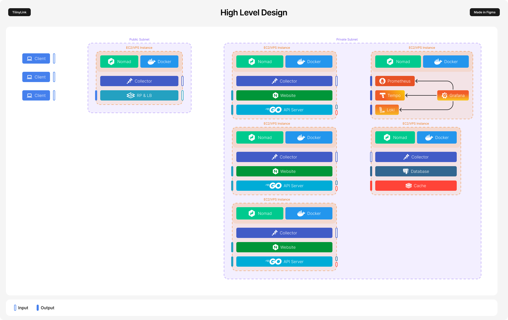

# Overview

TiiinyLink is a link shortener service that is designed to be highly available and scalable.

## Status

> [!Note]
> The project is still work in progress.

## Architecture



## Production setup

### Prerequisites

- AWS CLI (setup and working)
- Cloudflare (DNS API Token)
- Nomad
- Docker

### Steps

```sh
# Initialize infrastructure
$ terraform -chdir=deployment/infra/staging apply

# Run nomad script or set NOMAD_ADDR env var
$ . ./scripts/nomad.sh

# Bootstrap nomad acl (save secret token)
$ nomad acl bootstrap

# Initialize nomad variables
$ nomad var put nomad/jobs/server db_password=$(pass projects/tl/prod/postgres/password)
$ nomad var put nomad/jobs/grafana username=$(pass projects/tl/grafana/username) password=$(pass projects/tl/grafana/password)
$ nomad var put nomad/jobs/postgres password=$(pass projects/tl/prod/postgres/password)
$ nomad var put nomad/jobs/traefik acme_email=$(pass projects/tl/acme/email) cf_dns_api_token=$(pass projects/tl/cloudflare/dns_api_token)

# Run nomad plugins
$ nomad job run deployment/plugins/plugin-ebs-controller.nomad.hcl
$ nomad job run deployment/plugins/plugin-ebs-nodes.nomad.hcl

# Create host volumes
$ nomad volume create deployment/volumes/traefik.hcl

# Register CSI EBS volumes
$ nomad volume register deployment/volumes/postgres.hcl

# Run nomad jobs
$ nomad job run deployment/jobs/prometheus.nomad.hcl
$ nomad job run deployment/jobs/loki.nomad.hcl
$ nomad job run deployment/jobs/tempo.nomad.hcl
$ nomad job run deployment/jobs/grafana.nomad.hcl
$ nomad job run deployment/jobs/postgres.nomad.hcl
$ nomad job run deployment/jobs/redis.nomad.hcl
$ nomad job run deployment/jobs/traefik.nomad.hcl
$ nomad job run deployment/jobs/website.nomad.hcl
$ nomad job run deployment/jobs/server.nomad.hcl
```

## Development Setup

Follow these steps to set up your development environment:

```sh
# Clone repo
$ git clone https://github.com/loczek/tl

# Navigate to the project directory
$ cd tl

# Build and start the containers
$ docker compose up --build --watch
```
